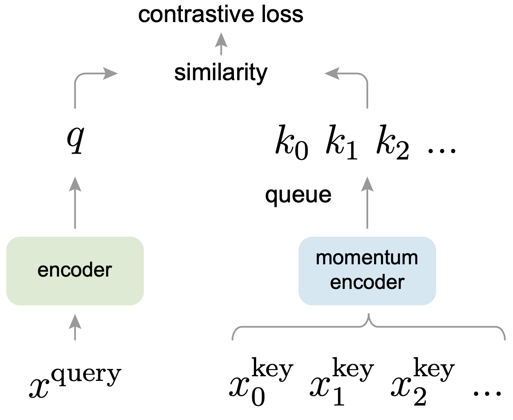

# MoCo
A PyTorch implementation of MoCo based on CVPR 2020 paper [Momentum Contrast for Unsupervised Visual Representation Learning](https://arxiv.org/abs/1911.05722).



## Requirements
- [Anaconda](https://www.anaconda.com/download/)
- [PyTorch](https://pytorch.org)
```
conda install pytorch=1.6.0 torchvision cudatoolkit=10.2 -c pytorch
```

## Dataset
`CIFAR10` dataset is used in this repo, the dataset will be downloaded into `data` directory by `PyTorch` automatically.

## Usage

### Train MoCo
```
python train.py --batch_size 1024 --epochs 50
optional arguments:
--feature_dim                 Feature dim for each image [default value is 128]
--m                           Negative sample number [default value is 4096]
--temperature                 Temperature used in softmax [default value is 0.5]
--momentum                    Momentum used for the update of memory bank [default value is 0.999]
--k                           Top k most similar images used to predict the label [default value is 200]
--batch_size                  Number of images in each mini-batch [default value is 256]
--epochs                      Number of sweeps over the dataset to train [default value is 500]
```

### Linear Evaluation
```
python linear.py --batch_size 1024 --epochs 200 
optional arguments:
--model_path                  The pretrained model path [default value is 'results/128_4096_0.5_0.999_200_256_500_model.pth']
--batch_size                  Number of images in each mini-batch [default value is 256]
--epochs                      Number of sweeps over the dataset to train [default value is 100]
```

## Results
There are some difference between this implementation and official implementation, the model (`ResNet50`) is trained on 
one NVIDIA GeForce GTX TITAN GPU:
1. No `Gaussian blur` used;
2. `Adam` optimizer with learning rate `1e-3` is used to replace `SGD` optimizer;
3. No `Linear learning rate scaling` used.

<table>
	<tbody>
		<!-- START TABLE -->
		<!-- TABLE HEADER -->
		<th>Evaluation Protocol</th>
		<th>Feature Dim</th>
		<th>Momentum</th>
		<th>Batch Size</th>
		<th>Epoch Num</th>
		<th>τ</th>
		<th>K</th>
		<th>Top1 Acc %</th>
		<th>Top5 Acc %</th>
		<th>Download</th>
		<!-- TABLE BODY -->
		<tr>
			<td align="center">KNN</td>
			<td align="center">128</td>
			<td align="center">0.999</td>
			<td align="center">256</td>
			<td align="center">500</td>
			<td align="center">0.5</td>
			<td align="center">200</td>
			<td align="center">80.9</td>
			<td align="center">99.1</td>
			<td align="center"><a href="https://pan.baidu.com/s/1GiMJFSuYubLMi550HtR88g">model</a>&nbsp;|&nbsp;tex8</td>
		</tr>
		<tr>
			<td align="center">Linear</td>
			<td align="center">-</td>
			<td align="center">-</td>
			<td align="center">256</td>
			<td align="center">100</td>
			<td align="center">-</td>
			<td align="center">-</td>
			<td align="center"><b>86.3</b></td>
			<td align="center"><b>99.6</b></td>
			<td align="center"><a href="https://pan.baidu.com/s/13n0gja_KxNFj1M6T6g4miw">model</a>&nbsp;|&nbsp;6me4</td>
		</tr>
	</tbody>
</table>


